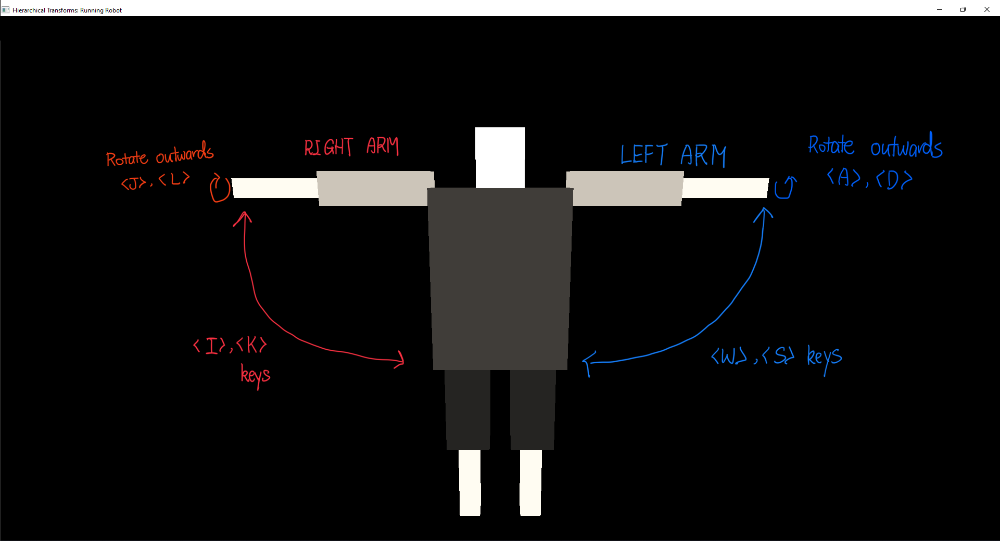
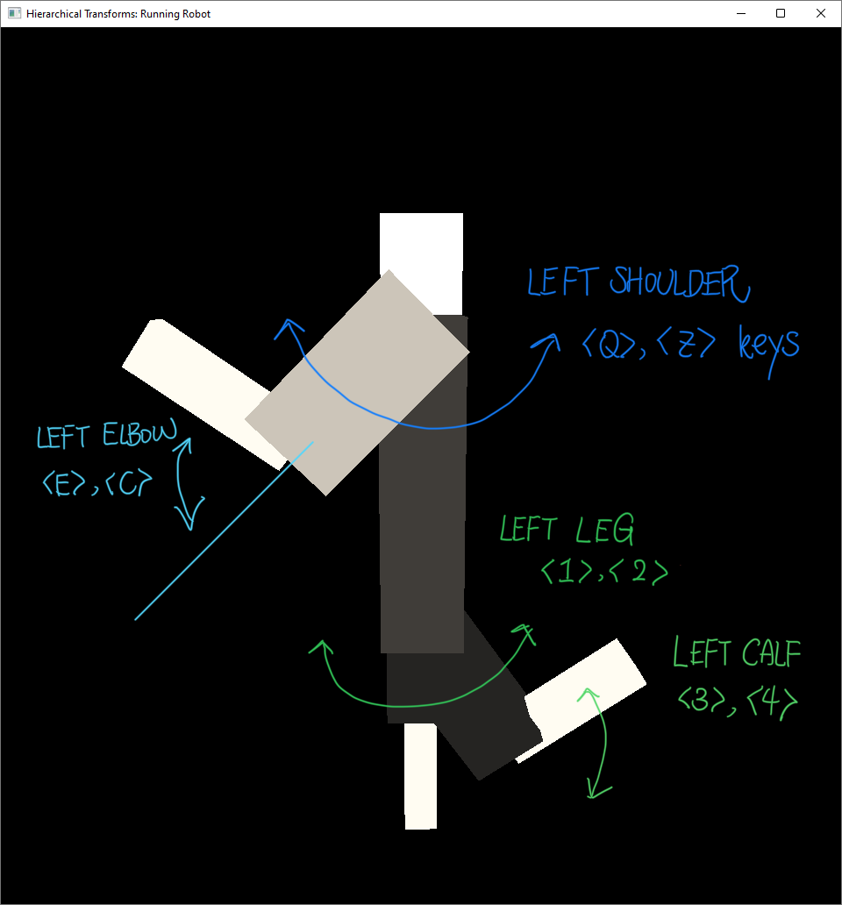
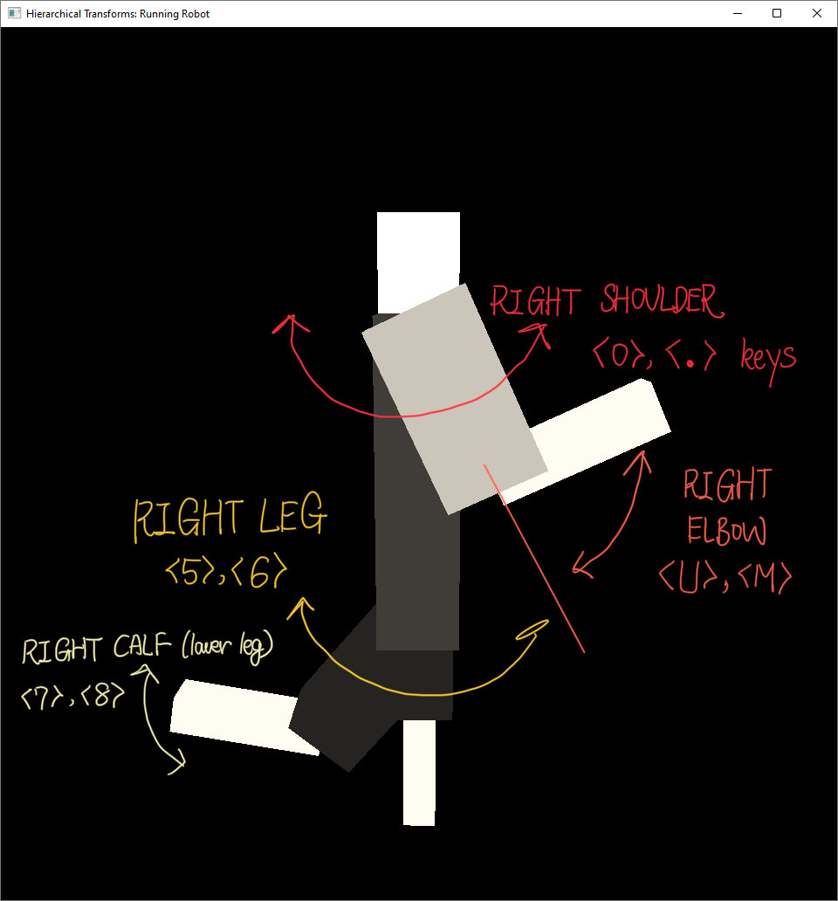

# HierarchicalTransforms
This program is an example of demonstrating hierarchical transformations in OpenGL.
Below is a figure of the designed robot.


## Testing Environment
* Microsoft Visual Studio 2019 Community Edition

## How to Run

The dependencies are packed in the `Dependencies/` directory, which we include the following libraries:
* [freeglut 3.0.0](https://www.transmissionzero.co.uk/software/freeglut-devel/)
* [glew 2.1.0](https://glew.sourceforge.net/index.html)


Simply open the `HierarchicalTransforms.sln` file in Visual Studio to open the project.
As long as OpenGL is configured on your PC (which is usually installed along with Microsoft Visual Studio), it should run without problems.
Press `<Ctrl> + <F5>` to build without debugging.

## Description

### Camera
Use the arrow keys `<UP> <DOWN> <LEFT> <RIGHT>` to rotate and move the camera.

### Manipulating each component
To manipulate the components of the robot, the general concept is that the left half of the robot is controlled by the left half of the keyboard, where the right half is controlled by the right half of the keyboard.
The left half of the keyboard includes the keys:
```
<W> <S> <A> <D>
<Q> <Z> <E> <C>
<1> <2> <3> <4>
```
Where the right half of the body is controlled by the right half of the keyboard:
```
<I> <K> <J> <L>
<O> <.> <U> <M>
<5> <6> <7> <8>
```
The mapping of each key to each component is shown in the three figures below:




### Running Robot
Press `<F5>` to set the robot to a running posture.

Press `<F6>` to toggle **Running Mode**, which makes the robot sprint.

Press `<F7>` to show or hide the moving ground during running mode.


You can also modify each component while the robot is running.
